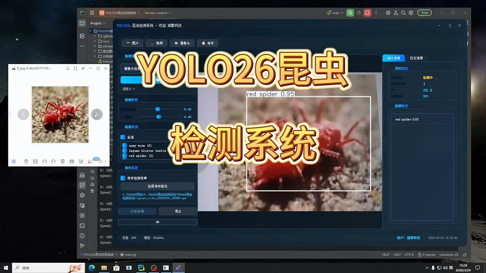
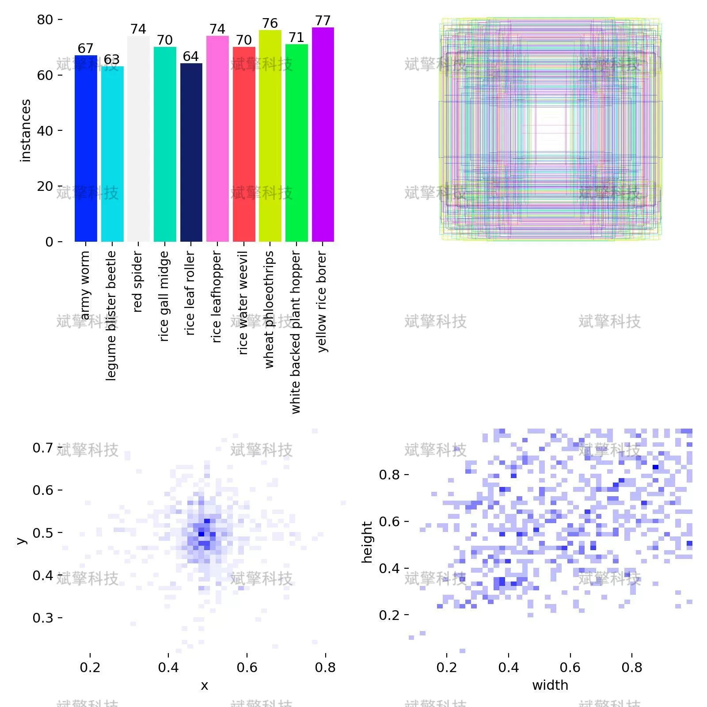
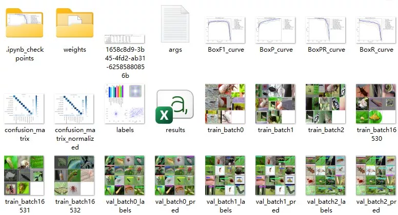
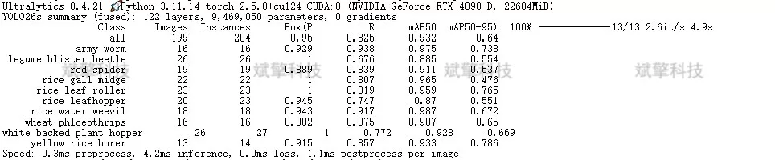
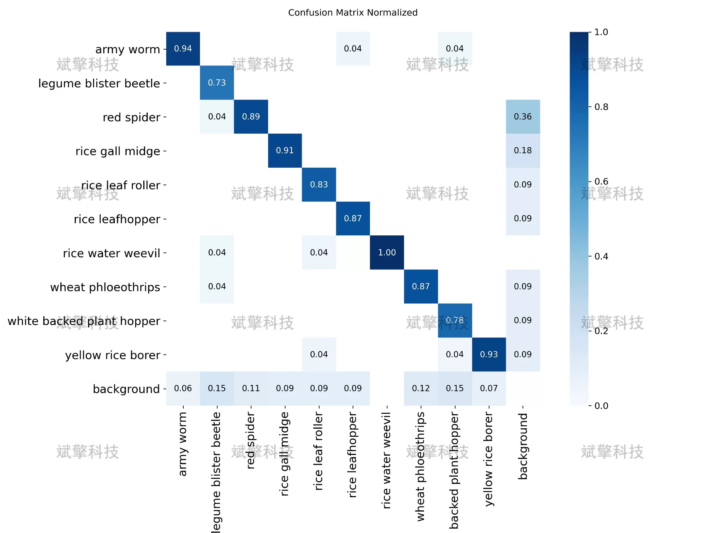
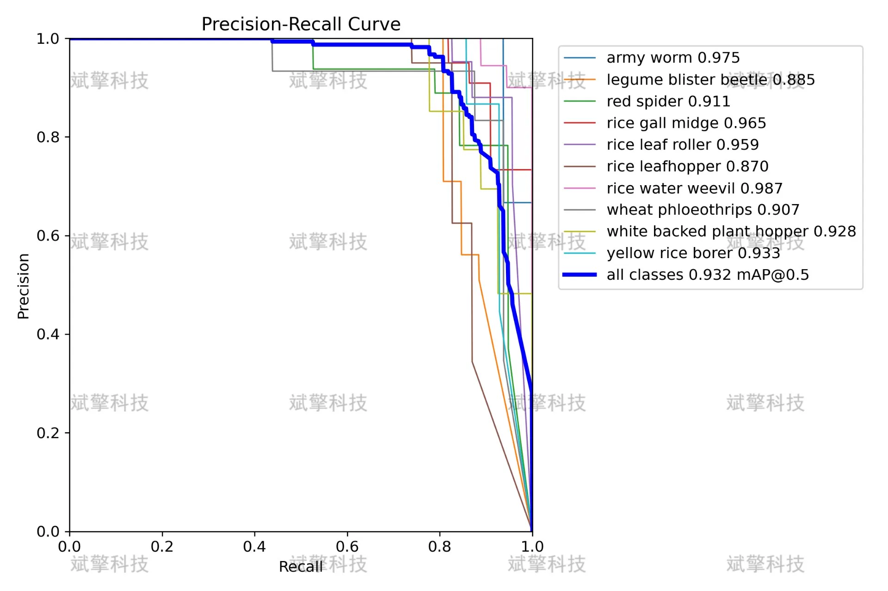
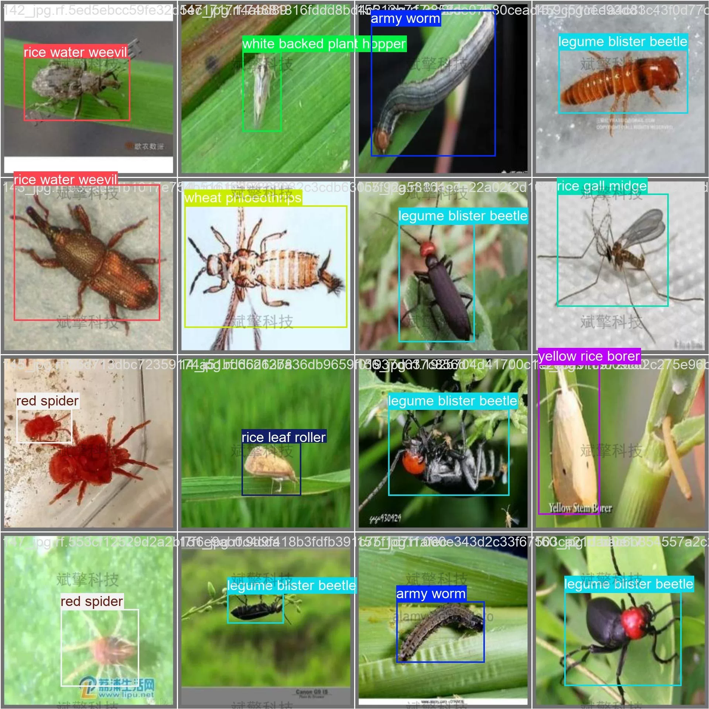
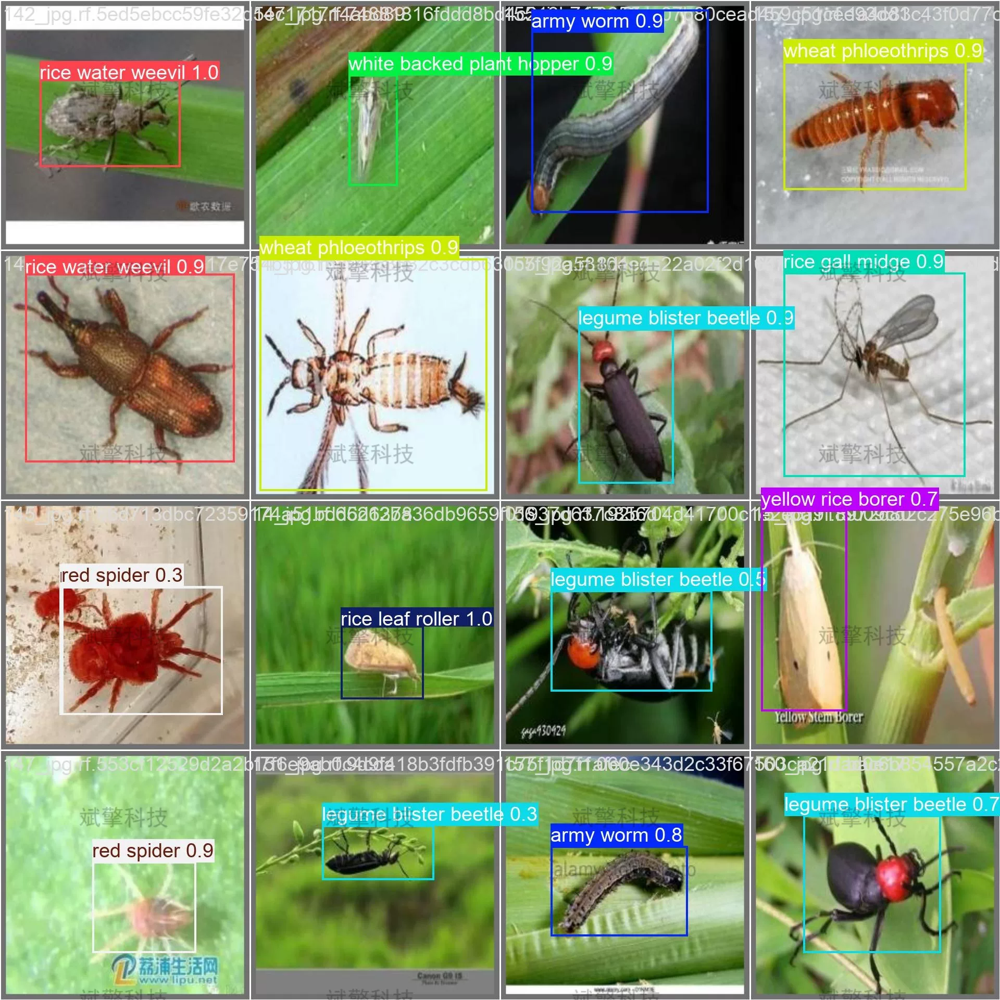

# YOLOv26 Insect Detection System | Source Code

## Body

YOLO26 Insect Detection System | Real-time Accurate: YOLO26-driven automatic detection and classification system for insects: full process of dataset construction, model training and deployment.

This paper constructs an agricultural pest detection system based on YOLO26, aiming to achieve automatic recognition and localization of 10 common rice and wheat pests. The system adopts YOLO26 as the core detection model, with a total of 995 labeled images in the training dataset, including 696 training images, 199 validation images, and 100 test images.

The experimental results show that the model achieves an overall average precision (mAP50) of 0.932 on the validation set, and mAP50-95 is 0.64. The inference speed for a single image is about 5.6ms, demonstrating both high accuracy and real-time performance. The confusion matrix and precision-recall curve further verify the stability and reliability of the model in multi-category detection. This system provides an efficient and scalable intelligent solution for agricultural pest monitoring.

The dataset used in this system consists of 995 high-resolution images of farmland, covering 10 common rice and wheat pests. The specific categories are as follows:
army worm (grasshopper)
legume blister beetle (bean weevil)
red spider (red spider)
rice gall midge (rice galling moth)
rice leaf roller (rice leaf roller)
rice leafhopper (rice leafhopper)

Rice water weevil (rice water beetle)
Wheat phloeothrips (wheat thrips)
White-backed plant hopper (white-backed planthopper)
Yellow rice borer (yellow rice borer)

Dataset is divided into training set, validation set and test set in the ratio of 7:2:1.
Training set: 696
Validation set: 199
Test set: 100

Free remote installation appointments. Unsuccessful, full refund.
Purchase includes the following resources (auto-unlocked by Baidu Pan)
YOLO recognition detection project complete source code
YOLO format dataset
Training code + UI interface code
Trained model + result images
Software installer package
Add WeChat to make a remote installation appointment (shown automatically after purchase) —— Unsuccessful, full refund

⚙️ Core Function Modules
Detection Capabilities
    Image Detection: Upon upload, returns detection boxes + category information.
    Video Detection: Supports video files, precise analysis of frames by frame.
    Camera Real-Time Detection: Attaches USB cameras to achieve dynamic monitoring.

️ Interaction and Control
    Target Filtering: Choose one or more categories for detection freely.
    Parameter Real-Time Adjustment: Adjustable confidence threshold & IoU threshold, flexibly control accuracy.
    Result Saving: One-click save of image/video/camera detection results.

System and Data

User Login and Registration: Supports password strength detection + Encrypted storage
Logging: Auto-records operation and error information (with timestamp)

## Images

## Payment

Here is a pay link on Stripe ( https://buy.stripe.com/3cs8yP7sY87d0vu9AB ). Please contact me lonlonago@foxmail.com after funding $89, and I will send you a complete data files , thank you!

